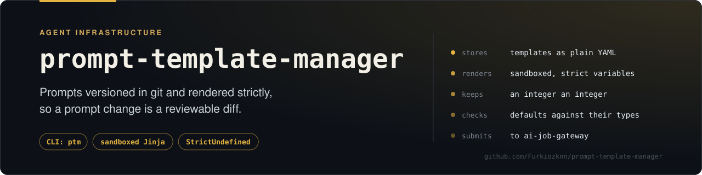
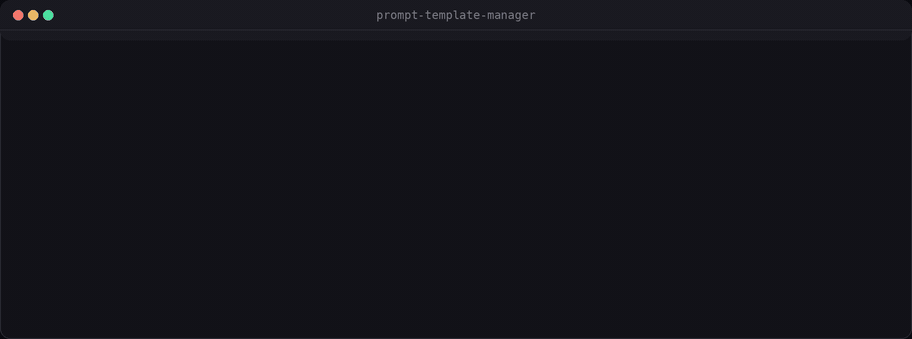
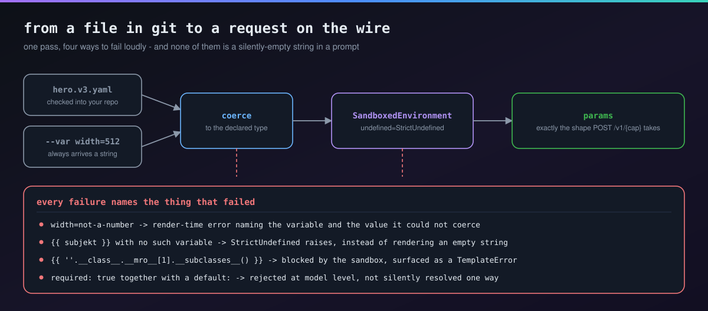
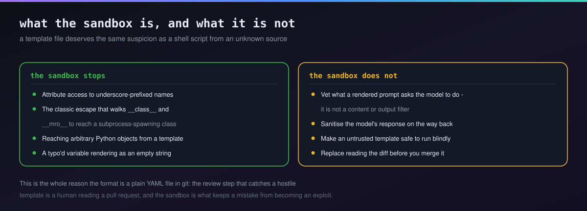

# prompt-template-manager

**Your prompts deserve `git diff`, not a database row.**

Versioned, git-diffable prompt/pipeline templates for generative-AI requests, rendered by a strict, sandboxed engine and driven by a small CLI (`ptm`).



<sub>Real output from <code>examples/product-photo.yaml</code>, a template in this repository.</sub>

## The problem this solves

Generation prompts tend to end up in one of two bad places: buried as string literals in application code (so changing a prompt means a code review and a deploy), or stashed as opaque rows in some internal "prompt management" database (so `git blame` and `git diff` — the tools you already trust for reviewing every other change to your system — can't see them at all).

`ptm` treats a prompt/pipeline request the same way you'd treat any other config: a plain YAML file, checked into the same repo as the code that uses it. Change a prompt, `git diff` shows exactly what changed — a word in the wording, a new variable, a different default — the same way it shows a code change. This is the same lesson ComfyUI's workflow-as-JSON teaches for node graphs, applied to the simpler case of parameterized prompts.

`ptm render` outputs exactly the params shape [`ai-job-gateway`](https://github.com/Furkiozknn/ai-job-gateway) expects for `POST /v1/{capability}` — the two are decoupled (no Python import between them, only the documented HTTP contract), but `ptm submit` closes the loop directly.

## Install

The distribution is named **`ptm-cli`**, the command it installs is `ptm`, and
the import package is `prompt_template_manager`. **It is not on PyPI yet**, so
install it from this repository — both of these work today:

```bash
# Run it without installing anything:
uvx --from git+https://github.com/Furkiozknn/prompt-template-manager ptm --help

# Or install the `ptm` command itself:
uv tool install git+https://github.com/Furkiozknn/prompt-template-manager
ptm --help
```

Once `ptm-cli` is published, `uv tool install ptm-cli` (or `pipx install
ptm-cli`, or `pip install ptm-cli`) will be the shorter route. Until then those
commands fail with *"ptm-cli was not found in the package registry"*, which is
why they are not the instruction above.

To work from a checkout instead, see [Quickstart](#quickstart) below — `uv sync`
installs this project in place and `uv run ptm` runs it.

## Quickstart

```bash
uv sync
uv run ptm validate examples/product-photo.yaml
# OK: product-photo-on-solid-background v1 (examples/product-photo.yaml)

uv run ptm render examples/product-photo.yaml --var product_name="a red sneaker" --pretty
# {
#   "prompt": "professional studio product photo of a red sneaker, on a seamless white background, soft even lighting, high detail, centered composition",
#   "width": 1024,
#   "height": 1024,
#   "seed": 0
# }

uv run ptm info examples/product-photo.yaml
# product-photo-on-solid-background  (v1)
#   A studio product photo on a solid background. `product_name` is required; ...
#   capability: mock-generate
#   variables:
#     product_name: string, required - What the photo is of, e.g. "a red sneaker"
#     background_color: string, default='white' - Backdrop color
#     ...

# Render + submit to a running ai-job-gateway-compatible server, wait for the result:
uv run ptm submit examples/product-photo.yaml --gateway-url http://127.0.0.1:8000 --var product_name="a red sneaker"
```

## A template

```yaml
name: product-photo-on-solid-background
version: "1"
capability: mock-generate
description: A studio product photo on a solid background.

variables:
  product_name:
    type: string
    required: true
    description: What the photo is of, e.g. "a red sneaker"
  background_color:
    type: string
    default: white
  width:
    type: integer
    default: 1024

params:
  prompt: "professional studio product photo of {{ product_name }}, on a seamless {{ background_color }} background, soft even lighting"
  width: "${width}"
```

Two substitution forms, both deliberate:

- **`{{ variable }}`** — ordinary [Jinja2](https://jinja.palletsprojects.com/) string interpolation, for building up prose like a prompt. Strict by design: a typo'd variable name fails the render immediately instead of silently rendering as an empty string.
- **`"${variable}"`** (a param value that is *exactly* this, nothing else) — direct substitution of the variable's typed value. Use this for non-string params (`width`, `seed`, a boolean flag) so an integer variable stays an integer instead of getting stringified by Jinja.

Everything else — a plain number, a plain string with no template syntax, a boolean — passes through as a literal, untouched.

## The CLI

### `validate`

Checks one or more templates without rendering them against any specific variable values — pass a single file or a shell glob:

```bash
ptm validate templates/*.yaml
# OK: product-photo-on-solid-background v1 (templates/photo.yaml)
# INVALID: templates/broken.yaml: params reference undeclared variable(s): typo_var
#
# 1 valid, 1 invalid
```

- **Hard error** if `params` references a variable (via either `{{ }}` or `${}`) that isn't declared in `variables`. This is a real bug — the render would fail the moment someone actually calls it.
- **Warning** for a variable that's declared but never referenced anywhere in `params` — almost certainly dead, worth a second look, but not broken.
- Exits non-zero if *any* file is invalid, with a summary line when checking more than one — designed to drop straight into CI (`ptm validate templates/*.yaml` as a pre-merge check, no shell loop required).

### `render`

Resolves variables and prints the fully rendered `params` object as JSON — exactly the body you'd `POST` to a gateway's `/v1/{capability}` endpoint.

Resolution order (highest priority first): `--var KEY=VALUE` flags, then `--vars-file`, then the template's declared `default:`. Missing a `required` variable, or several? You'll get one error naming every missing one, not a lecture that stops at the first:

```bash
ptm render templates/photo.yaml
# error: missing required variable(s): 'product_name' -- pass with --var name=value
#   (or --vars-file), or add a default in the template
```

Passed a `--var` whose name isn't declared? If it looks like a typo of a real one, `ptm` tells you:

```bash
ptm render templates/photo.yaml --var product_naem="a red sneaker"
# error: unknown variable(s) passed: 'product_naem' (did you mean 'product_name'?) ...
```

For templates with more than a couple of variables, `--vars-file path/to/vars.yaml` (JSON or YAML) beats a wall of repeated `--var` flags:

```bash
ptm render templates/photo.yaml --vars-file prod-run.yaml --pretty
```

### `info`

A quick human-readable summary of a template's variables, types, and defaults — useful before filling in `--var` flags by hand.

### `submit`

`render` + `POST` to `{gateway-url}/v1/{capability}` + poll until ready, using the [same submit/poll contract `ai-job-gateway` implements](https://github.com/Furkiozknn/ai-job-gateway) (works against any server implementing that contract, not only that specific repo). Accepts the same `--var` / `--vars-file` flags as `render`.

## Using it as a library

```python
from prompt_template_manager import load_template_file, load_vars_file, render_template, validate_template

template = load_template_file("examples/product-photo.yaml")
validate_template(template)  # raises TemplateError on a real problem
params = render_template(template, {"product_name": "a red sneaker"})
# params == {"prompt": "...", "width": 1024, "height": 1024, "seed": 0}
```

## Variable types



`string`, `integer`, `float`, `boolean`. A CLI `--var` value always arrives as a string (that's just how CLI args work) and gets coerced to the declared type — `--var width=512` becomes the integer `512`, `--var shout=true` becomes the boolean `True` (accepts `true`/`false`/`1`/`0`/`yes`/`no`, case-insensitive). A value that can't be coerced (`--var width=not-a-number`) is a render-time error naming exactly which variable and value failed.

A `required: true` variable and a `default:` are mutually exclusive at the model level — a required variable has no default by definition, and declaring both is rejected as a template error rather than silently picking one.

## Security



A prompt template is a file, and a file can come from somewhere other than your own keyboard: a shared team library, a downloaded example, a registry, a pull request from someone you haven't fully vetted. **Treat a template file with the same suspicion you'd treat a shell script from an unknown source.**

The renderer uses Jinja2's [`SandboxedEnvironment`](https://jinja.palletsprojects.com/en/stable/sandbox/) rather than the default `Environment`. With a plain `Environment`, a malicious template can escape string interpolation entirely and reach arbitrary Python objects and, from there, arbitrary code execution — the classic pattern is something like `{{ ''.__class__.__mro__[1].__subclasses__() }}` walking the class hierarchy to find something exploitable (e.g. a subprocess-spawning class). `SandboxedEnvironment` blocks attribute access to underscore-prefixed names and restricts what methods/attributes are reachable at all, turning that into a caught `TemplateError` instead of code execution:

```
error: template attempted an unsafe operation in '...': access to attribute
'__class__' of 'str' object is unsafe. (templates render in a sandboxed
Jinja2 environment; only variable interpolation and safe filters are
permitted, see README Security section)
```

This was a drop-in change with **no observed behavior difference** for legitimate templates: every template in this repo's test suite and examples only does plain `{{ var }}` interpolation and built-in filters, none of which the sandbox restricts. If you have a template relying on attribute access into a passed-in object (not currently possible via this CLI, since `--var`/`--vars-file` only ever produce plain strings, ints, floats, and bools — never rich objects), that's exactly the pattern the sandbox exists to catch.

**Honest limits of this mitigation, stated plainly:**

- Jinja2's own docs, and multiple public CVEs against other tools, note that sandbox *escapes* have existed historically — treat this as defense-in-depth, not a hard guarantee. The truly safe stance is to never render a template you don't trust at all, sandboxed or not.
- The sandbox constrains the Jinja2 evaluation itself. It does not, and cannot, vet the *content* a rendered prompt sends onward (e.g. a prompt-injection payload aimed at the downstream model) — that's a different, model-facing risk this tool has no visibility into.
- `${variable}` direct substitution never touches Jinja2 at all (it's a regex match + dict lookup), so it carries none of this risk in either direction — it's already about as safe as substitution gets.

## Development

```bash
uv sync --group dev
uv run pytest
```

The suite covers the model/loader/renderer layers directly and the CLI end-to-end (`capsys`-captured stdout/stderr, no subprocess spawning); the gateway-submission path is tested against `httpx.MockTransport`, no real server needed. 61 tests (`uv run pytest --collect-only -q` prints the current count).

## Limitations

Being upfront about what this is *not*:

- No prompt registry, no web UI, no built-in A/B testing or eval harness — it's a file format and a CLI, the review workflow is `git diff`/PR review, same as code.
- No template inheritance/includes (no `` / `` support) — each template file is self-contained by design, so a `git diff` on one file shows the whole picture.
- `submit`'s HTTP client is synchronous — it's a CLI convenience for one-off submission, not a library meant for embedding in an async application.
- Sandboxing mitigates Jinja2-level code execution; it is not a content/output filter and does not vet what a rendered prompt sends to the downstream model.

### `gateway_poll.py` is not ours

That module is copied verbatim from
[ai-job-gateway](https://github.com/Furkiozknn/ai-job-gateway), which owns the submit/poll
contract. Copying is deliberate — this project does not have to depend on the gateway — but
copies drift in silence: an edge case fixed upstream keeps biting here, and this repository
stays green against its own stale copy the whole time.

```sh
python3 arac/vendor-dogrula.py
```

It fetches the canonical file from `main`, normalises the package-name difference and fails on
anything else, printing the diff. With no network it **skips rather than passes** — "I could
not look" and "they are identical" are different facts, and a gate that conflates them is not
a gate. CI runs it on every push.

## License

MIT — see [LICENSE](LICENSE).

---

## More from this ecosystem

- **[ai-job-gateway](https://github.com/Furkiozknn/ai-job-gateway)** — the async job contract the rest of the pipeline speaks
- **[ai-workflow-engine](https://github.com/Furkiozknn/ai-workflow-engine)** — pipelines as plain YAML DAGs, validated before they run
- **[model-comparison-harness](https://github.com/Furkiozknn/model-comparison-harness)** — one request, N backends, latency and outcome side by side
- **[mcp-vet](https://github.com/Furkiozknn/mcp-vet)** — audits an MCP server's source before you install it

<sub>All of them in one searchable page: **[furkiozknn.github.io](https://furkiozknn.github.io/)** — each card is generated from that repository's own <code>project-meta.json</code>.</sub>
